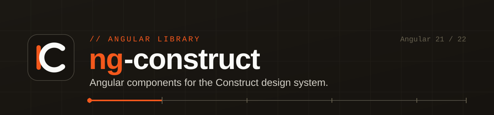

<div align="center">

[](https://www.npmjs.com/package/@neuravision/ng-construct)

# ng-construct

**The official Angular component library for the [Construct](https://github.com/Samyssmile/construct) design system.**

[](https://www.npmjs.com/package/@neuravision/ng-construct)
[](https://www.npmjs.com/package/@neuravision/ng-construct)
[](https://github.com/Samyssmile/ng-construct/actions/workflows/ci.yml)
[](https://angular.dev)
[](https://www.typescriptlang.org)
[](https://samyssmile.github.io/construct/)
[](LICENSE)
[](CONTRIBUTING.md)

[Install](#-install) · [Usage](#-usage) · [Components](#-components) · [Theming](#-theming) · [Design System](https://samyssmile.github.io/construct/) · [Contributing](CONTRIBUTING.md)

</div>

---

## Why ng-construct?

`ng-construct` wraps the framework-agnostic [Construct](https://github.com/Samyssmile/construct) CSS design
system into idiomatic, **modern Angular** components — so you get accessible, themeable UI with a typed,
signal-based API and zero boilerplate.

- ⚡ **Modern Angular** — standalone components, `input()` / `output()` functions, **signals** & `computed()`
- 🚀 **Fast by default** — `ChangeDetectionStrategy.OnPush` everywhere
- ♿ **Accessible** — built on Construct's WCAG 2.1 AA foundation (keyboard, ARIA, focus management)
- 🧩 **47+ components** — forms, overlays, data display, navigation, full app shells
- 🎨 **Themeable** — light / dark / high-contrast via a single `data-theme` attribute
- 📝 **Forms-ready** — inputs implement `ControlValueAccessor` for reactive & template-driven forms
- 🔤 **Fully typed** — first-class TypeScript, autocomplete for every input

## 📦 Install

```bash
npm install @neuravision/ng-construct @neuravision/construct @lucide/angular
```

Add the Construct global styles to your `styles.css`:

```css
@import '@neuravision/construct/foundations.css';
@import '@neuravision/construct/components/components.css';
```

**Requirements:** Angular `21.1+` or `22.x` · `@neuravision/construct` `^2.0.0`

## 🚀 Usage

Import the standalone components you need and use their `af-` selectors:

```typescript
import { Component } from '@angular/core';
import { AfButtonComponent, AfInputComponent } from '@neuravision/ng-construct';

@Component({
  selector: 'app-login',
  imports: [AfInputComponent, AfButtonComponent],
  template: `
    <af-input label="Email" type="email" placeholder="name@company.com" [(value)]="email" />
    <af-button variant="primary" (click)="onSubmit()">Sign in</af-button>
  `,
})
export class LoginComponent {
  email = '';
  onSubmit() { /* ... */ }
}
```

## 🎨 Theming

Theming is inherited from Construct — set `data-theme` on `<html>` (or any container):

```html
<html data-theme="dark"> … </html>
```

Supported values: `light` (default), `dark`, `high-contrast`. With none set, the system preference
(`prefers-color-scheme`, `prefers-contrast`) is respected automatically.

## 🧩 Components

| Component | Selector | Category |
|-----------|----------|----------|
| Accordion | `af-accordion` | Layout |
| Alert | `af-alert` | Feedback |
| App Shell | `af-app-shell` | Layout |
| App Shell V2 | `af-app-shell-v2` | Layout |
| Avatar | `af-avatar` | Data Display |
| Badge | `af-badge` | Data Display |
| Banner | `af-banner` | Feedback |
| Breadcrumbs | `af-breadcrumbs` | Navigation |
| Button | `af-button` | Actions |
| Card | `af-card` | Layout |
| Checkbox | `af-checkbox` | Data Entry |
| Chip | `af-chip` | Data Display |
| Chip Input | `af-chip-input` | Data Entry |
| Combobox | `af-combobox` | Data Entry |
| Data Table | `af-data-table` | Data Display |
| Datepicker | `af-datepicker` | Data Entry |
| Divider | `af-divider` | Layout |
| Drawer | `af-drawer` | Overlays |
| Dropdown | `af-dropdown` | Overlays |
| Empty State | `af-empty-state` | Feedback |
| Field | `af-field` | Form |
| File Upload | `af-file-upload` | Data Entry |
| Icon | `af-icon` | Data Display |
| Input | `af-input` | Data Entry |
| List | `af-list` | Data Display |
| Modal | `af-modal` | Overlays |
| Navbar | `af-navbar` | Navigation |
| Nav Tabs | `af-nav-tabs` | Navigation |
| Pagination | `af-pagination` | Navigation |
| Popover | `af-popover` | Overlays |
| Progress Bar | `af-progress-bar` | Feedback |
| Radio | `af-radio` | Data Entry |
| Select | `af-select` | Data Entry |
| Select Menu | `af-select-menu` | Data Entry |
| Sidebar | `af-sidebar` | Layout |
| Skeleton | `af-skeleton` | Feedback |
| Skip Link | `af-skip-link` | Navigation |
| Slider | `af-slider` | Data Entry |
| Spinner | `af-spinner` | Feedback |
| Switch | `af-switch` | Data Entry |
| Table | `af-table` | Data Display |
| Tabs | `af-tabs` | Layout |
| Textarea | `af-textarea` | Data Entry |
| Toast | `AfToastService` | Feedback |
| Toggle Group | `af-toggle-group` | Actions |
| Toolbar | `af-toolbar` | Actions |
| Tooltip | `af-tooltip` | Overlays |

### Services & Pipes

| Export | Description |
|--------|-------------|
| `AfToastService` | Programmatic toast notifications |
| `AfFormatLabelPipe` | Transforms `snake_case` → Title Case |

## 🛠️ Development

This repository is an Angular workspace with two projects:

- **`projects/angular`** — the `@neuravision/ng-construct` library (built with ng-packagr)
- **`projects/demo`** — a showcase app that consumes the library

```bash
npm install              # setup
npm start                # demo app → http://localhost:4200
npm run build            # build library, then demo
ng test                  # unit tests (Vitest)
```

> The demo app must be built **after** the library, since it imports from `@neuravision/ng-construct`
> (resolved to `dist/angular`).

## 🤝 Contributing

Contributions are welcome! See the [Contributing Guide](CONTRIBUTING.md) and
[Code of Conduct](CODE_OF_CONDUCT.md). For security reports, see [SECURITY.md](SECURITY.md).

## 🔗 Related

- [**Construct**](https://github.com/Samyssmile/construct) — the underlying framework-agnostic design system
- [**Live Storybook**](https://samyssmile.github.io/construct/) — interactive component & token reference

## 📄 License

[MIT](LICENSE) © Construct contributors
